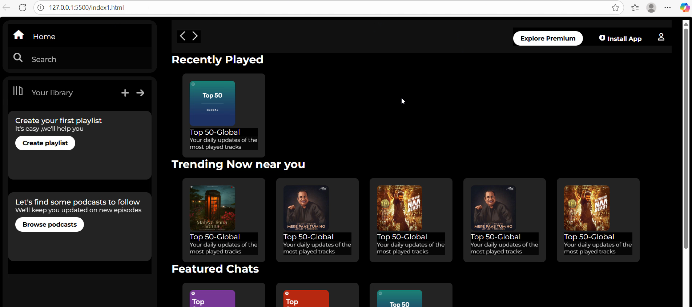

<div align="center">

# 🎵 Spotify-Inspired Music Streaming UI

### A modern, responsive Spotify-inspired web interface built with HTML, CSS & JavaScript


<br><br>

<a href="YOUR_LIVE_DEMO_LINK">
  
</a>

<a href="https://github.com/VarshaPatil18/spotify_clone">
  
</a>

</div>

---

## ✨ Overview

This project recreates the core Spotify user experience through a clean and responsive frontend interface.

The application focuses on delivering a visually appealing music streaming platform featuring playlist sections, trending music cards, navigation menus, and a modern dark-themed design inspired by Spotify.

---

# 📸 Project Showcase

## 🏠 Homepage



---

# 🚀 Key Features

### 🎧 Music Streaming Interface

* Interactive music player layout
* Album artwork cards
* Playlist organization
* Song recommendation sections

### 🎨 Modern UI/UX

* Spotify-inspired design system
* Clean dark mode aesthetics
* Smooth hover effects
* Consistent component styling

### 📱 Responsive Design

* Mobile-friendly layout
* Tablet support
* Desktop optimization

### 📚 Library Management UI

* Library navigation panel
* Playlist creation cards
* Podcast recommendation section

### 🔍 Navigation Experience

* Sidebar navigation
* Search section
* Premium section
* User profile controls

---

# 🛠️ Tech Stack

| Technology   | Purpose       |
| ------------ | ------------- |
| HTML5        | Structure     |
| CSS3         | Styling       |
| JavaScript   | Interactivity |
| Font Awesome | Icons         |
| Google Fonts | Typography    |

---

# 📂 Project Structure

```bash
spotify_clone/
│
├── assets/
│   ├── images/
│   └── songs/
│
├── index1.html
├── style2.css
├── homepages.png
├── homepages1.png
└── README.md
```

---

# 🎯 Skills Demonstrated

✅ Responsive Web Design

✅ Flexbox & Layout Systems

✅ Modern UI Development

✅ Frontend Architecture

✅ DOM Manipulation

✅ Component-Based Thinking

✅ User Interface Design

---

# 🌟 Future Enhancements

* 🔐 User Authentication
* 🎵 Dynamic Song Loading
* ❤️ Favorite Songs
* 🔍 Advanced Search
* 🌙 Dark/Light Theme Toggle
* 🎧 Spotify API Integration

---

# 📈 Project Highlights

<div align="center">

| Metric               | Status |
| -------------------- | ------ |
| UI Design            | ⭐⭐⭐⭐⭐  |
| Responsiveness       | ⭐⭐⭐⭐⭐  |
| User Experience      | ⭐⭐⭐⭐⭐  |
| Frontend Development | ⭐⭐⭐⭐⭐  |

</div>

---

# 👩‍💻 Developer

### Varsha Patil

<a href="https://github.com/VarshaPatil18">

</a>

<a href="YOUR_LINKEDIN_LINK">

</a>

---

<div align="center">

### ⭐ If you enjoyed this project, consider giving it a star!

🎵 Built with passion for frontend development.

</div>
